# Event Widget Flow Diagram

This document describes the complete flow of the `EmbedWidget` component, which handles the event ticketing and checkout experience.

## Overview

The EmbedWidget is a multi-step, embeddable ticketing widget that allows users to:
1. View event details
2. Select tickets
3. Add optional addons
4. Enter guest information
5. Review and pay
6. Receive confirmation

---

## High-Level Flow


---

## Detailed State Machine


---

## Component Structure


---

## Data Flow

```mermaid
flowchart LR
    subgraph Props
        E[event]
        T[tiers]
        CT[cheapestTier]
        AA[availableAddons]
        FR[feeRates]
    end

    subgraph State
        ST[selectedTickets]
        SA[selectedAddons]
        GN[guestName]
        GE[guestEmail]
        GP[guestPhone]
        D[discount]
        PT[purchasedTickets]
        V[view]
    end

    subgraph Calculations
        CF[calculateFinancials]
    end

    subgraph APIs
        CR[createReservation]
        PI[/api/paystack/initialize]
        PV[/api/paystack/verify]
    end

    E --> CF
    T --> CF
    ST --> CF
    SA --> CF
    D --> CF
    FR --> CF

    ST --> CR
    SA --> CR
    GN --> CR
    GE --> CR
    GP --> CR
    D --> CR

    CR --> PT
    PT --> PI
    GE --> PI
    CF --> PI

    PI --> PV
    PV --> PT
```

---

## Checkout Flow Detail

```mermaid
sequenceDiagram
    participant U as User
    participant W as Widget
    participant S as Supabase
    participant P as Paystack API
    participant V as Verify API

    U->>W: Fill name, email, phone
    U->>W: Click "Continue"
    
    W->>W: handleCreateReservation()
    W->>S: createReservation() for each tier
    S-->>W: Reservation IDs
    W->>W: setView('summary')
    
    U->>W: Click "Pay Now"
    W->>W: handlePaystackPayment()
    
    alt Free Ticket (total = 0)
        W->>W: setView('success')
    else Paid Ticket
        W->>P: POST /api/paystack/initialize
        P-->>W: authorization_url, reference
        
        alt Popup Available
            W->>W: PaystackPop.setup()
            U->>P: Complete Payment in Popup
            P-->>W: callback(reference)
        else Redirect
            W->>P: Redirect to authorization_url
            P-->>W: Redirect back with reference
        end
        
        W->>V: POST /api/paystack/verify
        V->>S: Update reservation status
        V->>S: Create tickets
        V-->>W: tickets[]
        W->>W: setView('success')
        W->>W: confetti 🎉
    end
```



---

## View States & Actions

| View | Description | Actions Available |
|------|-------------|-------------------|
| **details** | Event info, description, host, lineup | "Get Tickets" → tickets |
| **tickets** | Ticket tier selection with quantity | Back, Continue → addons/checkout |
| **addons** | Optional addon selection | Back, Continue → checkout |
| **checkout** | Guest info form | Back, "Continue" → summary |
| **summary** | Order review with promo code, timer | Back, Apply Promo, "Pay Now" |
| **success** | Confirmation with ticket details | Download PDF, Add to Calendar, Share |

---

## URL Parameters

| Parameter | Description | Example |
|-----------|-------------|---------|
| `theme` | Light or dark mode | `theme=dark` |
| `color` | Primary color (hex without #) | `color=FF5500` |
| `view` | Initial view to show | `view=tickets` |
| `hideDetails` | Skip details view | `hideDetails=true` |
| `ref` | Referral tracking code | `ref=instagram` |
| `font` | Custom font family | `font=Inter` |
| `layout` | Layout mode | `layout=compact` |
| `reference` | Payment callback reference | Set by Paystack |
| `event_id` | Event ID for callback matching | Set during payment |

---

## Key Features

### 1. **Theming**
- Supports light/dark modes via `theme` param
- Custom primary color via `color` param
- Custom font via `font` param

### 2. **Discounts**
- Promo codes validated against `gatepass.discounts` table
- Supports fixed amount or percentage discounts
- Expiry and usage limit checks

### 3. **Fee Calculation**
- Uses `calculateFees()` utility
- Respects event's `fee_bearer` setting (customer/organizer)
- Applies effective fee rates

### 4. **Reservation Timer**
- 10-minute countdown on summary view
- Visual urgency for completing payment

### 5. **Payment Methods**
- Paystack popup (preferred)
- Paystack redirect (fallback)
- Free ticket bypass

### 6. **Success Actions**
- Download ticket PDF
- Add to calendar (Google/Apple)
- Share event
- View all tickets
